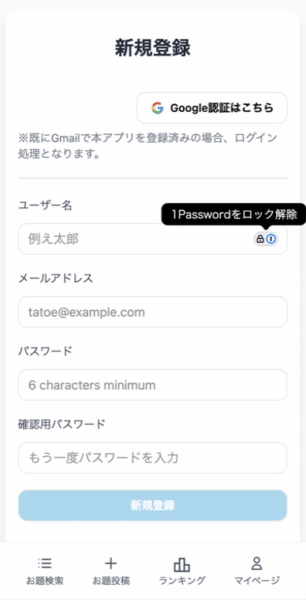
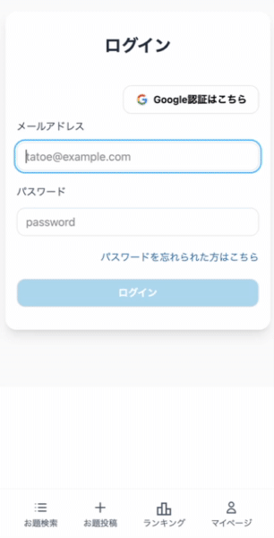
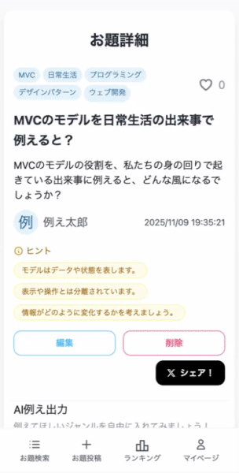
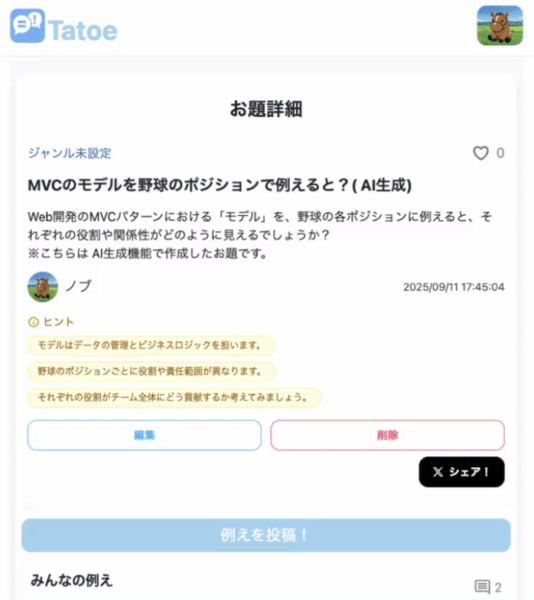
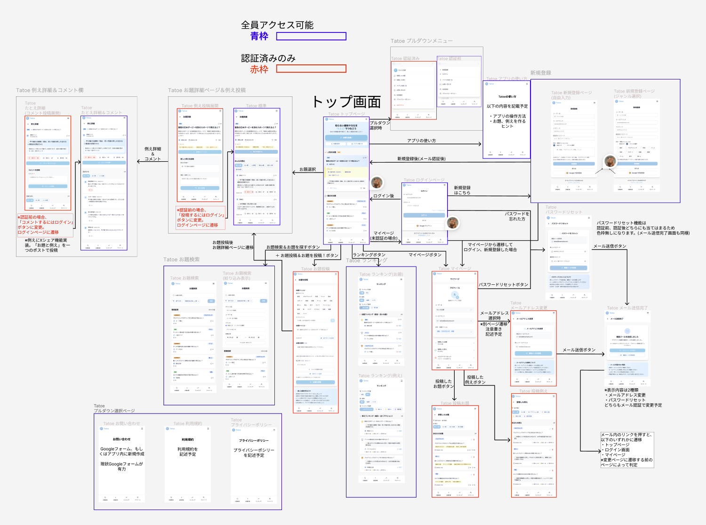
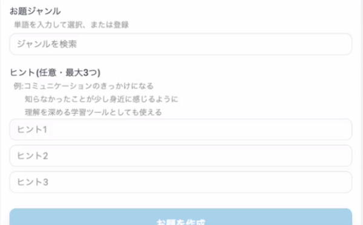

# Tatoe〜例えでつながる共感アプリ〜

## サービスURL：https://tatoe.net
## ゲストユーザー用アカウント
アカウントを作らない方は以下をお使いください。(マイページにて登録情報を変更しないようお願いします。)<br>
**メールアドレス：guest@example.com**<br>
**パスワード：password**
## 目次
- [サービス概要](#サービス概要)
- [開発背景](#開発背景)
- [ターゲット](#ターゲット)
   - [ターゲット層](#ターゲット層)
   - [ターゲット層の理由](#ターゲット層の理由)
- [機能紹介](#機能紹介)
   - [認証機能](#認証機能)
   - [お題投稿と例え投稿(AI生成)](#お題投稿と例え投稿(AI生成))
   - [例えコメントと例えリアクション](#例えコメントと例えリアクション)
   - [Xシェア機能](#Xシェア機能)
- [技術構成](#技術構成)
   - [使用技術](#使用技術)
   - [画面遷移図](#画面遷移図)
   - [ER図](#ER図)
- [工夫した実装](#工夫した実装)
   - [お題と例えのAI出力機能](#お題/例えのAI出力機能)
   - [ジャンル選択オートコンプリート機能](#ジャンル選択オートコンプリート機能)
   - [動的OGPによるXシェア機能](#動的OGPによるXシェア機能)
## サービス概要
このサービスは、普段接点のない趣味や文化、職業などを、ユーザー同士で“例え”を使って共感を生むアプリです。<br>
知ってほしい趣味、文化、職業」をお題として登録し、それに対して他のユーザーが「自分の得意分野」で例えていく<br>
ユーザー参加型例え大喜利アプリになります。

## 開発背景
私自身、競馬という趣味を持っていますが、ギャンブルというイメージが先行してしまい、魅力を伝えるのは中々難しいなぁと考えていました。<br>
私と同じように「好きなんだけど、上手く伝えづらいなぁ」と悩みを抱える方々は一定数いらっしゃるのでは？と思います。<br>
そこで、その人の好きな分野で例え話をすることで、共感が生まれやすくなるのでは？と思い、今回のアプリを開発しようと考えました。
## ターゲット
### ターゲット層
- 年齢：10代後半〜30代
- 性別：男女問わず
- 特徴：
   - 少数派の趣味や職業を伝えたい、広めたい方
   - 新たな趣味を見つけたい方
   - 例えることが好き、得意な方
   - ネタ投稿や大喜利ネタが好きな方

### ターゲット層の理由
- 自分をアピールしたいけど、あまり盛り上がる趣味を持ってない...と感じている方が少なくないと感じているため
- SNSにてよく見られる**大喜利**や**ネットミーム**と親和性が高いため
- 別の視点から物事を見ることで、新たな気づきを得るきっかけになるため
## 機能紹介
### 認証機能
| ユーザー登録         | ログイン                                                                     |
| -------------------- | ---------------------------------------------------------------------------- |
|  |  |
| 新規登録画面では「ユーザー名」「メールアドレス」「パスワード」「確認用パスワード」を入力して、登録処理を行います。 | ログイン画面では「メールアドレス」「パスワード」を入力して、ログイン処理を行います。 |

Google認証を使用して簡単に新規登録＆ログインが可能です。Gmailアドレスでログイン済みの方は、自動的にそのメールアドレスでログインされます。
- - -
### お題投稿と例え投稿(AI生成)
| お題投稿　　　　　　　　　　　　| 例え投稿                                             |
| --------------------------------- | -------------------------------------------------- |
|  |  |
| 例えてもらうお題を投稿できます。ジャンルやヒントを登録することで例えやすいお題を作成出来ます。 | お題に対して例えを投稿出来ます。自分の好きなこと・得意なことを中心に考えると例えやすいです。|

お題と例えが思いつかない場合、**AI生成機能**(GeminiAI API)を使用すると簡単に生成出来ます。思いついたワードを入力してみましょう。
- - -
### 例えコメントと例えリアクション
| 例えコメントページ | 例えリアクション/ランキング |
| ------------------- | ---------------- |
|  |  |
| 共感・納得・笑ってしまった例えにコメントを残すことが出来ます。交流の場としてお使いいただけます。 | 例えに対してリアクションを残すことが出来ます。「共感」「納得」「爆笑」といったリアクションを用意しています。リアクションをした例えはランキングページに反映されます。|
- - -
### Xシェア機能
| お題シェア |
| ---------- |
|  |
| 気に入ったお題・例えはXに投稿して共有することが出来ます。OGPは内容によって変更されるので、一目見るだけで内容を把握することが出来ます。

## 技術構成
### 使用技術

| 項目      | 内容                                                   |
| ------- | ---------------------------------------------------- |
| バックエンド  | Ruby on Rails 7.2.3・Ruby 3.2.3                 |
| フロントエンド | TailwindCSS, Daisy UI, Hotwire(Turbo・Stimulus) |
| データベース  | PostgreSQL                                           |
| ストレージ   | AWS S3|
| 認証        | Devise |
| デプロイ    | Render |
| 開発環境    | Docker |
| 外部API    | GeminiAI API（gemini-2.5-flash-lite）                 |

### 画面遷移図
[Tatoe 画面遷移図](https://www.figma.com/design/h52ZY57d0laEO1PN7lCgp2/Tatoe?node-id=0-1&t=EiHWBsNduQXxuWzz-1) ←Figmaはこちら


### ER図


## 工夫した実装
### 目次
- [お題・例えのAI出力機能](#お題・例えのAI出力機能)
- [ジャンル選択オートコンプリート機能](#ジャンル選択オートコンプリート機能)
- [動的OGPによるXシェア機能](#動的OGPによるXシェア機能)
- - -
### お題と例えのAI出力機能
#### どういった機能か？
今回作成したアプリは**テーマに対して様々な物事で例える**というコンセプトになります。<br>
しかし、物事に例えるのは意外にも難しく、投稿する前にアプリから離れてしまう欠点があるのを感じていました。

そこで、自身の興味あるジャンルを入力するだけで、手軽にお題や例えが投稿できる機能があれば投稿のハードルを下げることができるのでは？と思い、今回AI生成機能を実装しました。
#### 処理の流れ

1. **AI生成ボタンをクリック〜アプリケーション・サーバーへのリクエスト**<br>
前提として今回はStimulusを使用した非同期処理を採用しています。<br>
まずは好きなジャンルを入力してStimulusで定義したボタンをクリックします。(ジャンルは空欄でも問題ありませんが、現状以下の課題を抱えています。)<br>
[ジャンル未入力時にAI生成をすると、例文の内容そのまま出力してしまうことがある](#ジャンル未入力時にAI生成をすると、例文の内容そのまま出力してしまうことがある)

コントローラの内容は以下のとおりです。(一部省略)
```javascript:javascript/controllers/gemini_topic_controller.js
export default class extends Controller {
  static targets = ["genre", "compare", "title", "description", "genres", "hint_1", "hint_2", "hint_3", "button"]

  output() {

    const genre = this.genreTarget.value;
    const compare = this.compareTarget.value;
    const labelsArea = document.querySelector("#labels-area");
    const hiddenArea = document.querySelector("#hidden-area");
    this.genreAllDelete(labelsArea)
    this.genreAllDelete(hiddenArea)
    this.buttonTarget.innerHTML = `AI出力中...<span class="loading loading-spinner text-info ml-2"></span>`;

    fetch("generate_ai", {
      method: "POST",
      headers: {
        "Content-Type": "application/json",
        "X-CSRF-Token": document.head.querySelector("meta[name=csrf-token]")?.content
      },
      body: JSON.stringify({
        genre: genre,
        compare: compare
      })
    })
```
ルーティングで設定したgenerate_aiコントローラーにPOSTメソッドを定義したHTTPリクエストを作成します。POST送信になるのでhtmlヘッダーのCSRFトークンを取得し、JSON形式でサーバーにリクエストを送信します。<br>

2. **geminiAPI用サービスオブジェクトでの処理**<br>
AI生成は外部APIとの連携になるので、Serviceパターンを使用しました。<br>
[gemini_generation_service.rb](https://github.com/Nobu-DD/Tatoe/blob/develop/app/services/gemini_generation_service.rb)<br>

処理の内容は大きく分けて2つあります。<br>
- **GeminiAI APIに送信するHTTPクラス作成**<br>
railsではGeminiAI APIと連携するgemが存在していないため、以下の記事を参考にしてリクエスト・レスポンス処理を作成しました。APIキーは`.env`ファイル内で管理しているので、情報漏洩のリスクは非常に低いです。<br>
[Geminiで真偽判定する機能を作ってみた（Ruby on Rails）](https://zenn.dev/nir_nmttg/articles/464519457cf818)
- **リクエストボディに含めるプロンプト作成**<br>
お題と例えそれぞれのプロンプト作成メソッドを作成しました。例としてお題作成のコードを記述します。
```ruby:gemini_generation_service.rb
def topic_request_body
{
  systemInstruction: {
    parts: [ {
      text: "あなたは、ユーザーから与えられた2つの要素(ジャンルと例えの分野)を組み合わせて、ユニークな「例え」の問いかけを生成する専門家です。ユーザーの想像力を刺激し、議論を深めるような、面白くて意外性のある問いかけを1つ提案してください。出力は、厳密に指定されたJSONスキーマに従ってください。なお、入力されていない要素があった場合、指定しているフォーマットを参考にして、自由に作成してください"
    } ],
    role: "model"
  },
  contents: [ {
    parts: [ {
      text: <<~PROMPT
      まずは以下のフォーマットに従ってtitleを出力してください。

      入力:
      ジャンル: 競馬
      例えてほしい内容: 他のスポーツ

      出力:
      競馬の日本ダービーをサッカーの大会で例えると？

      入力:
      ジャンル: 手芸
      例えてほしい内容: ブルーカラーの職業

      出力:
      手芸の刺繍を土方の業務で例えると？

      入力:
      ジャンル: #{@params[:genre]}
      例えてほしい内容: #{@params[:compare]}

      出力:
      title: [キーワード]の[キーワード]を[キーワード]で例えると？
      description: 生成した:titleの意図を簡潔に説明してください。少し柔らかい表現で出力してください。
      genres: ユーザーが提示した「#{@params[:genre]}」と「#{@params[:compare]}」の2つのキーワードと、:titleに関連したジャンル名を配列として5つ以内に含めてください。
      hints: :titleに対して例えやすくなるように、ヒントを3つ箇条書きで提供してください。1つのヒントにつき30文字前後で出力してください。
      PROMPT
    } ],
    role: "user"
  } ],
  generationConfig: {
    responseMimeType: "application/json",
    responseSchema: {
      type: "object",
      properties: {
        title: { type: "string" },
        description: { type: "string" },
        genres: {
          type: "array",
          items: { type: "string" }
        },
        hints: {
          type: "object",
          properties: {
            hint_1: { type: "string" },
            hint_2: { type: "string" },
            hint_3: { type: "string" }
          }
        }
      },
      required: [ "title", "description", "genres", "hints" ]
    }
  }
}.to_json
end
```
APIに送信するプロンプトは以下の内容を意識して作成しました。
   - **例えてもらう前提の文章構造(「〜とは？」「〜で例えて！」など)**
   - **同じ形式で出力される再現性(上記のような生成を毎回生成出来るか)**

出力される内容がある程度固定するように入力と出力の例文を2つ提示することで、AIが生成しやすい環境を作るようにしました。
また、AIに対してレスポンス内容をJSON形式で指定することで、再現性の高い回答を出力させています。<br>
プロンプト生成時の流れは以下の記事にまとまっています。<br>
[AIに伝えるプロンプトを僕なりに成形してみた](https://note.com/nobu64a/n/n588a12728a54)

3. **AI生成レスポンス受取後の処理(ジャンルセーブ処理)**<br>
APIからのレスポンス処理をViewに返す前に、データベースに存在しないジャンル名を新規登録します。<br>
新規登録する理由として、後述する[ジャンルオートコンプリート機能](#ジャンル選択オートコンプリート機能)でジャンルを選択する処理にてgenres.idが必要になるからです。

```javascript:gemini_topic_controller.js
.then(response => response.json())
.then(data => {
  this.titleTarget.value = data["title"];
  this.descriptionTarget.value = data["description"];
  this.genresSetting(data["genres"]);
  this.hint_1Target.value = data["hints"]["hint_1"];
  this.hint_2Target.value = data["hints"]["hint_2"];
  this.hint_3Target.value = data["hints"]["hint_3"];
  this.buttonTarget.innerHTML = "AI出力"
})
.catch((error) => {
  alert("AI生成に失敗しました。時間を置いてもう一度お試しください。");
  console.error(error);
  this.buttonTarget.innerHTML = "AI出力";
});
```
サーバーからのレスポンス内容をそれぞれのinputフィールドに格納します。`genresSetting`メソッドはオートコンプリート機能でジャンル選択済みの状態にするための処理が書かれています。
#### 現在抱えている課題
- **ジャンル未入力時にAI生成をすると、例文の内容そのまま出力してしまうことがある**<br>
フォーマットをある程度固定するために例文を2つ提示していますが、例文をそのまま出力してしまうことがあります。頻繁に発生する不具合ではありませんが、今後プロンプトの内容をブラッシュアップしていく必要があります。
- - -
### ジャンル選択オートコンプリート機能
#### どういった機能か？
お題新規登録時、**手軽にジャンルを選択出来る**為に実装しました。ジャンルを入力すると文字列が一致しているジャンルをDBから取得し、非同期で出現させます。出現したジャンルを選択すると、選択済みの状態に変化します。
今回の機能は**Stimulusを使用したJSのアウトプット**も兼ねています。<br>


#### 処理の流れ
今回オートコンプリートを実装するために[stimulus-autocomplete](https://github.com/afcapel/stimulus-autocomplete)の一部コードを流用しています。Tatoeアプリに対応するため以下の機能を新たに実装しました。
- **ジャンル候補選択時にフォーム用のbutton(削除用)タグとhiddenタグ追加**<br>
上記2つのタグは以下の役割を持っています。
   - button：ジャンル選択の表示＆削除処理
   - hidden：お題登録時、ジャンル名をサーバーに送信するために使用<br>
選択後のbuttonとhiddenは以下の内容で出力されます。
```ruby:app/views/topics/new.html.erb
<div class="flex flex-wrap space-x-2" data-autocomplete-target="labels">
  <button class="bg-[#E0F2FE] hover:bg-[#ACCDE2] cursor-pointer text-[#0369A1] text-lg px-2 py-1 rounded-full mb-2" type="button" id="genre-[id]">ここにジャンル名が入ります   ✕</button>
</div>
<div data-autocomplete-target="hidden">
  <input type="hidden" name="topic[genre_names][]" id="genre-[id]" value="ここにジャンル名が入ります">
</div>
```
ジャンルを選択すると、それぞれ定義したターゲットに「ジャンル名」・「ジャンルID」を含めた子要素を追加します。ジャンルIDを使用して一意に識別するように定義しています。
- **完全一致のジャンルが無い時の新規登録処理**<br>
オートコンプリート機能はgenresテーブルに存在しているデータのみ取得するので、新たにジャンルを登録して選択済みにする処理を定義しました。内容としてinputに入力した値とオートコンプリートで取得した値が**完全一致**であるか判定させています。
```javascript
// ジャンルを登録するボタンを表示
addGenreCreateButton() {
const genreName = this.inputTarget.value
if (!!this.resultsTarget.querySelector("li")) {
  const genres = this.resultsTarget.querySelectorAll("li")
  const genresName = [...genres].map(li => li.innerHTML.trim())
  if (genresName.includes(genreName)) return
}
this.resultsShown = true
this.element.setAttribute("aria-expanded", "true")
const genreButton = document.createElement("button")
genreButton.setAttribute("type", "button")
genreButton.setAttribute("role", "option")
genreButton.classList.add("btn", "btn-lg", "btn-outline", "btn-info", "mb-2")
genreButton.setAttribute("name", "genre")
genreButton.value = `${genreName}`
genreButton.innerHTML = `「${genreName}」を登録して選択`
genreButton.addEventListener("click",this.genreCreate)
this.resultsTarget.prepend(genreButton)
}
```
`genreName`にはinputに入力したジャンル名、`genresName`にはオートコンプリートでDBから取得したジャンル名を配列として取得しています。includesメソッドを使用して**完全一致**のジャンル名が存在しない場合、新規登録用のボタンを親要素内の先頭(prepend)に配置します。<br>
```javascript
// ジャンルを新規登録する処理
genreCreate = (event) => {
const genreElement = event.target
fetch("/genre", {
  method: "POST",
  headers: {
    "Content-Type": "application/json",
    "X-CSRF-Token": document.head.querySelector("meta[name=csrf-token]")?.content
  },
  body: JSON.stringify({
    genre:{
      name: genreElement.value
    }
  })
})
.then(response => response.json())
.then(data => {
  const genreId = `genre-${data.genre.id}`
  this.addFlash(data)
  this.addTopicGenre(genreId, data.genre.name)
  this.hideAndRemoveOptions()
  this.inputTarget.value = ""
})
.catch((error) => {
  alert("ジャンル登録に失敗しました。")
  console.error(error)
  this.hideAndRemoveOptions()
})
}
```
新規登録ボタンを押すとgenresコントローラのcreateアクションにてジャンル登録を行い、選択状態にします。
- ボタンを押した時のジャンル削除処理
ジャンル削除処理はボタン作成時に付与させたイベントハンドラ(onDeleteGenreメソッド実行)によって実行させます。
```javascript
onDeleteGenre = (event) => {
  const genreId = event.target.id
  event.target.remove()
  this.hiddenTarget.querySelector(`#${genreId}`).remove()
}
```
先にボタンを削除し、事前に取得したid(genres-[id])で対象のhiddenタグを削除します。
#### 現在抱えている課題
- `autocomplete_controller.js`の可読性<br>
元々`stimulus-autocomplete`ライブラリのソースコードから手を加えているので、**300行超え**の冗長なコードになってしまいました。そのため該当するメソッドを探し出す為に時間が掛かってしまう問題点が残っています。これは今後リファクタリングが必要になってくると考えています。
### 動的OGPによるXシェア機能


